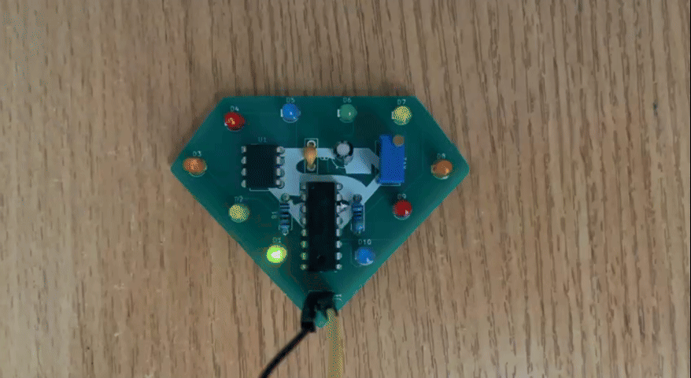
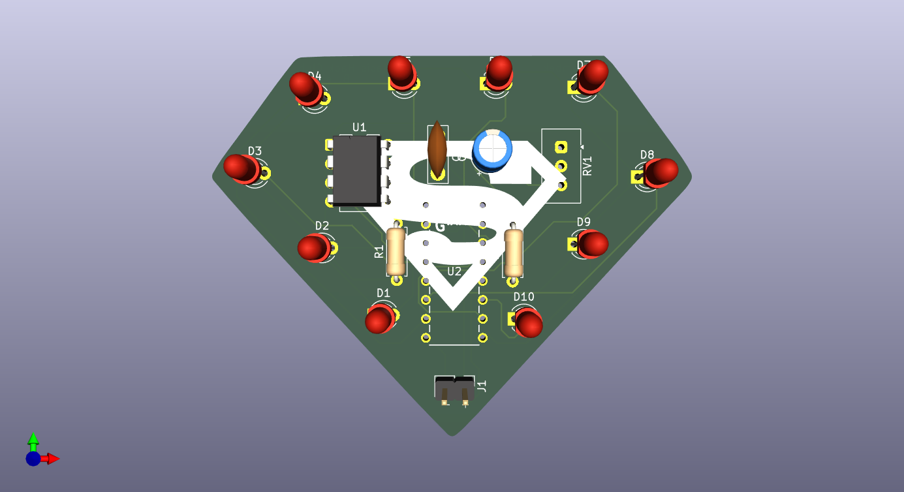

# 555 LED Chaser

I designed Led chaser in diamond-shaped pcb (to give superman look). I accomplished this by following a guide. I tried to avoid via's in pcb and I did it

Gerbers and BOM are in the production folder

Note: Potentiometer doesn't making any changes in speed, most likely wrong potentiometer or less likely wrong schematic